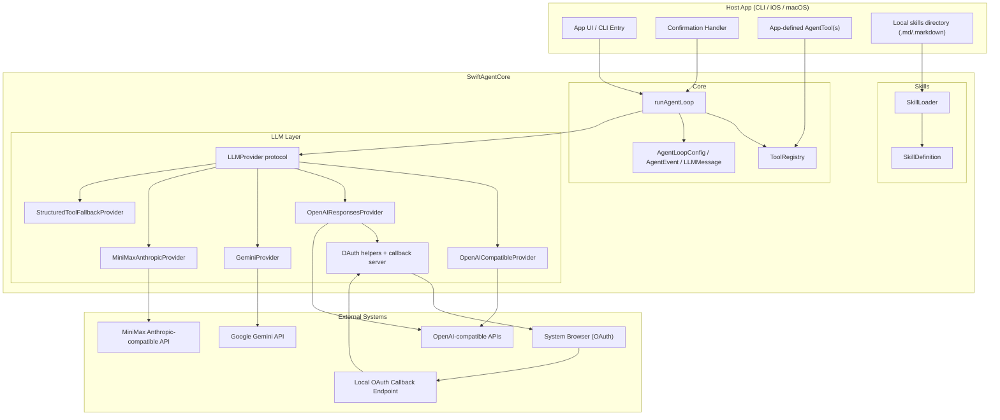

# SwiftAgentCore

[](https://github.com/herrkaefer/SwiftAgentCore/tags)
[](https://github.com/herrkaefer/SwiftAgentCore/actions/workflows/ci.yml)
[](https://swiftpackageindex.com/herrkaefer/SwiftAgentCore)
[](https://swiftpackageindex.com/herrkaefer/SwiftAgentCore)
[](https://swiftpackageindex.com/herrkaefer/SwiftAgentCore)
[](LICENSE)

SwiftAgentCore is a Swift agent runtime with a unified multi-provider LLM layer, built-in tool execution, and skill loading.

## Features

- Lightweight & Portable - Zero external package dependencies. Supports macOS 13+ / iOS 16+.
- Multi-Provider - OpenAI-compatible (DeepSeek, Groq, Ollama, OpenRouter), Anthropic, Gemini - unified behind a single provider interface.
- Runtime Only - Pure agent runtime with no built-in tools or provider presets. You define every tool and choose your provider - nothing opinionated, fully composable.
- Streaming-First - Token-level SSE streaming across all providers, delivered via AsyncStream and callback.
- Minimal Design - No class hierarchies, no macros, no result builders. Small API surface, easy to integrate.
- Built-in OAuth - PKCE flows for Anthropic Claude and OpenAI Codex with automatic token refresh.
- Tool Fallback - Transparent tool-calling emulation for models that don't support it natively.
- Tool Confirmation - Safety-level gating on tools with user confirmation before execution.
- Skill Loading - Load agent skills from markdown files with front-matter metadata.

## Requirements

- Swift 5.9+
- macOS 13+ / iOS 16+

## Installation

Add SwiftAgentCore as a dependency in your `Package.swift`:

```swift
dependencies: [
    .package(url: "https://github.com/herrkaefer/SwiftAgentCore.git", from: "1.1.0")
],
targets: [
    .target(
        name: "YourTarget",
        dependencies: [
            .product(name: "SwiftAgentCore", package: "SwiftAgentCore")
        ]
    )
]
```

## Quick Start

```swift
import Foundation
import SwiftAgentCore

struct EchoTool: AgentTool {
    let name = "echo"
    let description = "Echo a message."
    let safetyLevel: ToolSafetyLevel = .safe

    let inputSchema: JSONObject = [
        "type": .string("object"),
        "properties": .object([
            "message": .object(["type": .string("string")])
        ]),
        "required": .array([.string("message")])
    ]

    func execute(input: JSONObject) async throws -> String {
        input["message"]?.stringValue ?? ""
    }

    func humanReadableSummary(for input: JSONObject) -> String {
        "Echo message: \(input["message"]?.stringValue ?? "")"
    }
}

let provider = OpenAICompatibleProvider(
    displayName: "OpenAI API",
    profile: .openAIAPI,
    config: LLMProviderConfig(
        baseURL: URL(string: "https://api.openai.com/v1")!,
        authMethod: .apiKey(ProcessInfo.processInfo.environment["OPENAI_API_KEY"] ?? ""),
        model: "gpt-4o-mini"
    )
)

let config = AgentLoopConfig(
    provider: provider,
    tools: [EchoTool()],
    buildSystemPrompt: { "You are a helpful assistant." },
    confirmationHandler: { _, _ in true }
)

let stream = runAgentLoop(
    config: config,
    initialMessages: [.text(role: .user, "Say hello, then use the echo tool with 'done'.")],
    onEvent: { event in
        if case .messageTextDelta(let delta) = event {
            print(delta, terminator: "")
        }
    }
)

for await _ in stream {}
```

## Agent Loop Architecture

### System Structure (Modules + External Interactions)



## Provider Examples

### OpenAI-compatible

```swift
let provider = OpenAICompatibleProvider(
    profile: .openAIAPI,
    config: LLMProviderConfig(
        baseURL: URL(string: "https://api.openai.com/v1")!,
        authMethod: .apiKey("<API_KEY>"),
        model: "gpt-4o-mini"
    )
)
```

### OpenAI Codex Responses API

```swift
let oauth = OpenAICodexOAuth()
let provider = OpenAIResponsesProvider(
    credentials: oauthCredentials,
    oauthProvider: oauth,
    model: "codex-mini-latest"
)
```

### Gemini

```swift
let provider = GeminiProvider(
    apiKey: "<GEMINI_API_KEY>",
    model: "gemini-2.0-flash"
)
```

### MiniMax Anthropic-compatible

```swift
let provider = MiniMaxAnthropicProvider(
    apiKey: "<MINIMAX_API_KEY>",
    model: "MiniMax-M2.5"
)
```

### Structured Tool Fallback

Wrap any provider to emulate tool calling via JSON envelopes when native tool calling is unavailable:

```swift
let wrapped = StructuredToolFallbackProvider(base: provider)
```

## State Management Notes

SwiftAgentCore includes **runtime conversation state** inside the agent loop:

- Turn index
- Pending follow-up messages
- In-memory conversation history

It does **not** include persistent state storage, database session management, or app-level global store/reducer patterns. Persisting and restoring sessions should be handled by the host app.

## Roadmap (v1.1)

The next minor release focuses on interview-ready onboarding and stronger runtime validation:

- [ ] Add `Examples/` runnable demos (CLI and UI) with real LLM-triggered tool calling.
- [x] Add an Agent loop architecture diagram to this README (message/tool/confirmation flow).
- [x] Add core tests for `AgentLoop` and `SkillLoader` to balance existing provider-heavy coverage.
- [ ] Add clearer memory/context guidance and APIs for session-level context management.
- [ ] Add an optional MCP (Model Context Protocol) client module for external tool servers.
- [ ] Add context-window management strategies (trimming and summarization) for long conversations.

## Skills

`SkillLoader` can load markdown skill files with front matter into `SkillDefinition` values:

- `name`
- `description`
- `disable-model-invocation`
- prompt body content

Example skill file (`skills/summarize.md`):

```markdown
---
name: summarize
description: Summarize user text concisely
disable-model-invocation: false
---
When the user asks for a summary:
- Return a concise bullet list.
- Keep original meaning unchanged.
```

Load and apply a skill:

```swift
import Foundation
import SwiftAgentCore

let loader = SkillLoader()
let skillsDir = URL(fileURLWithPath: "/path/to/skills")
let selectedSkill = try loader.loadSkill(named: "summarize", from: skillsDir)

let systemPrompt = """
You are a helpful assistant.
\(selectedSkill?.systemPromptContent ?? "")
"""
```

## Development

Run tests:

```bash
swift test
```

## Release Checklist (Swift Package Index)

- Ensure the repository is public on GitHub.
- Ensure the package URL ends with `.git`.
- Create and push at least one semantic version tag (for example, `1.0.0`):

```bash
git tag 1.0.0
git push origin 1.0.0
```

- Verify package metadata and build locally:

```bash
swift package dump-package
swift build --target SwiftAgentCore
swift test
```
